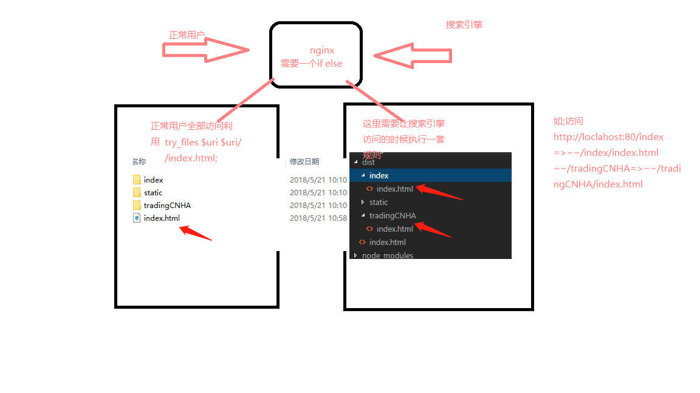

## 前后端分离
##### 前言
其实如果单纯的去想前后端分离并不好，想一下一个java 用 jsp 就可以搭起来我自己写数据自己渲染是不是很轻松很愉快。
but 当你知道单页面这个概念的时候，你的想法就会变化，原来页面的体验可以这样，原来页面不用再去重复请求了，我们只需要换数据就好了
https://zhuanlan.zhihu.com/p/25565788 =》来源
代码的健壮需解耦！！！

前后端分离，本地前端开发调用接口会有跨域问题，一般有以下3种解决方法：

1. 后端接口打包到本地运行（缺点：每次后端更新都要去测试服下一个更新包，还要在本地搭建java运行环境，麻烦）

2. CORS跨域：后端接口在返回的时候，在header中加入'Access-Control-Allow-origin':* ;
   ！设置请求的时候会不允许发送cookie 设置后可允许 后台 Access-Control-Allow-Credentials true;前端也需要设置Credentials为true;

3. 用nodejs搭建本地http服务器，并且判断访问接口URL时进行转发，完美解决本地开发时候的跨域问题。webpack-dev 代理

4. 使用谷歌的插件解决:https://chrome.google.com/webstore/detail/allow-control-allow-origi/nlfbmbojpeacfghkpbjhddihlkkiljbi

5. 或者谷歌开启允许跨域,参考 http://camnpr.com/archives/chrome-args-disable-web-security.html

1.公司是否前后端分离 是否使用构建工具 是否使用git

2.spa页面
```
问题=》 seo搜索拦路虎  Prerender 预渲染 当搜索引擎后者蜘蛛爬虫访问网站的时候在服务器端对其转接js渲染完成的页面
单页面的用户体验 ↑↑↑
express phantomjs 搭建静态页面解决spa的seo问题
https://www.youtube.com/watch?v=iYEQMJc1yak 快速方案prerender-node
//说说我的解决方案
webpack插件犹如神助 PrerenderSPAPlugin 生成环境打包的时候生成静态页面，
利用nginx进行区分搜索引擎与正常用户，写一套匹配规则，让搜索引擎区爬静态页面.

//spa的动态js优化插件 动态路由进行预加载
webpackConfig.plugins.push(new PreloadWebpackPlugin({
    rel: 'prefetch',
}));
rel 有2个属性 preload / prefetch
```
3.前端性能优化
```
 从两方面来看：
  1.用户的角度去讲，当然是页面越快越好=》页面的渲染速度要快，及时的响应操作=》此时此刻代码没有最快，只有更快。
  2.服务商角度去讲，首当其中就是减少http请求了，其实是带宽，再然后当然就是节省资源了。
 1>（首当其冲）减少http请求
  每次请求都是携带者时间成本（浏览器的并发请求是有次数限制，等待的进度条会很慢体验感极差），资源成本的，
  一次完整的http请求需要经过DNS寻址，与服务器立连接，发送资源，等待服务器响应，接受数据这样一个漫长而不是超出掌控的过程。
  时间成本会让用户体验感不好，资源成本呢就是带宽了。 
  1.1>从设计层面去减少
      比方说百度首页，他的简介程度足以说明一切了吧。但是往往有些时候作为前端你绕不过去↓
  1.2>合理设置HTTP缓存
      缓存为什么快相信很简单吧，下载到本地的小电影可以随便快进吧，网上呢？所以呢当他尽可能的缓存好了反正他们的手机内存也不差你这几百k的数据。
      接下来说说 干货=》注意一点缓存的请求状态是304只有请求header没有body会节省带宽，
      对于不变的资源使用在请求时候 HTTP Header中的Expires设置一个很长的过期头时间越久越好，
      对与变化但是不频繁变化的数据使用Last-Modifed来做请求验证，尽可能的让资源在缓存中存在的更久。
      想深入的小伙伴=》搜索 
      HTTP1.1协议中关于缓存策略的描述 Fiddler HTTP Performance中关于缓存的介绍
  1.3>资源的合并与压缩
    如果可以的话，尽可能的将外部的脚本、样式进行合并，多个合为一个。
    另外， CSS、 Javascript、Image 都可以用相应的工具进行压缩，压缩后往往能省下不少空间
    1.4>CSS Sprites
    雪碧图，多个icon一个图
    1.5>Lazy Load Images
    按需加载，惰性加载，其实并不能减少只是能一下不请求那么多，如不理解不知道你会不会瀑布流
    
 2>脚本加载放在底部，内联脚本异步加载
    Web Workers是一种机制，通过它可以使一个脚本操作在与Web应用程序的主执行线程分离的后台线程中运行。
    这样做的优点是可以在单独的线程中执行繁琐的处理，让主（通常是UI）线程运行而不被阻塞/减慢 =>MDN 官网翻译
 3>.减少不必要的 HTTP跳转　　
    对于以目录形式访问的 HTTP链接,很多人都会忽略链接最后是否带 ’/'，假如你的服务器对此是区别对待的话，
    那么你也需要注意，这其中很可能隐藏了301跳转，增加了多余请求。　　
 4>. 避免重复的资源请求　　
    这种情况主要是由于疏忽或页面由多个模块拼接而成，然后每个模块中请求了同样的资源时，会导致资源的重复请求
    
 5>.代码优化简单一说大家都懂程序员是出了名的懒 带上一句至高追求=》一行代码实现一切功能
   预解释 作用域链 DOM碎片 事件委托 页面回流重绘 数据访问多次写变量 不必要时不必包 不使用with 拒绝eval 字符串拼接用join 提倡新版ES
```
4.js记录 ES6
```
  ES6新数据类型 Symbol
  ES6新型数据结构
  Set WeakSet Map 
  对象的深拷贝
  https://juejin.im/post/5abb55ee6fb9a028e33b7e0a
  1.JSON.parse(JSON.stringify(Obj)) 
   存在问题
     函数对象，正则对象，弃用constructor,对象的循环引用
  2.细节访问掘金
  3.思考：实现一个无限嵌套对象的深度拷贝
  ...[1,2,3]  => 1,2,3  Math.max(...[1,2,3])  Math.max.apply(null,[2,3,4,5,61,1])
  实现2个数组的差集，并集，交集合
  let a = new Set([1, 2, 3]);
  let b = new Set([4, 3, 2]);
  // 并集
  let union = new Set([...a, ...b]);
  // Set {1, 2, 3, 4}
  // 交集
  let intersect = new Set([...a].filter(x => b.has(x)));
  // set {2, 3}
  // 差集
  let difference = new Set([...a].filter(x => !b.has(x)));
  // Set {1}
  //事件中心
  const initEventEmitter = {
   _events: {},
   subscribe(event,callback){
     if(!this._events[event]){
       this._events[event] = []
     }
     this._events[event].push(callback)
   },
   unSubscribe(event){
     if(this._events && this._events[event]){
       delete this._events[event]
     }
   },
   dispatch(event,...arg){
     if(!this._events[event]){
         return
     }
     var i ;
     for( i = 0 ; i<this._events[event].length; i++ ){
         this._events[event][i](...arg)
     }
   }
  }
  //再见vue响应式
  http://jungahuang.com/2018/02/07/About-responsive-of-Vue/#more
  //eventBus
  https://segmentfault.com/a/1190000012808179
  //vue源码攻读
```


## Node 
### web3 学习
```
搭建express 
npm install web3
error node-gyp rebuild
https://github.com/nodejs/node-gyp 解决方案
https://github.com/felixrieseberg/windows-build-tools =》下载源c编译node_module
admin powershell
 npm install --global --production windows-build-tools
success 添加python环境变量（目录地址可以通过npm config list 查看） win用户苦逼 
重启 vscode  记得先验证 python 的环境变量
接下来开始学习(API)
web3关于tocken 去区块浏览器查询 交易的ABI Solidity
http://solidity.readthedocs.io/en/v0.4.21/ 智能合约学习
```
```
node种for循环异步嵌套的问题 优雅的利用promise
forEachOf 中嵌套if判断 最后结果没有等待！👇 打开注释余关闭注释 留心观察
var v =[]
var arr = [1,2,3,4,5,6,7,8,9,10]
async.forEachOf(arr,(item,key,callback)=>{
    one()
    .then(()=>{
        // if(item>3){
            two()
            .then(()=>{
                v.push(1) 
                callback()
            })
        // }      
    })
    
},err=>{
    console.log(v)
})
function one (){
    return new Promise((resolve,reject)=>{
        resolve()
    })
}
function two (){
    return new Promise((resolve,reject)=>{
        resolve()
    })
}
//解决

function result(){
var isEnd = 0
   ,isEnds = 0
 return new Promise((resolve,reject)=>{
     arr.forEach((item,key,arr)=>{
      one()
      .then(()=>{
         if(item<3){
            isEnds++
            two()
            .then(()=>{
              isEnd++
               if(isEnd == isEnds){
                 v.push(1)
                 resolve(v)
               }
            })
         }
      })
    }) 
  })
} 
result().then((a)=>{console.log(a)})
```
### bitcore 学习
```
error npm install -g --unsafe-perm=true bitcore
Permission denied
```
### 2018 5/30 开发启用window 使用Ubuntu
```
梯子 https://www.sundabao.com/ubuntu%E4%BD%BF%E7%94%A8shadowsocks/
关于自动代理模式使用pac模式 文件目录记得vpn设置自动 制定pac文件目录
关于geit
Set document metadata failed: 不支持设置属性 metadata::gedit-positionin
sudo -H  gedit /etc/apt/sources.list &>/dev/null
微信客户端
electronic-wechat  https://github.com/geeeeeeeeek/electronic-wechat
```
